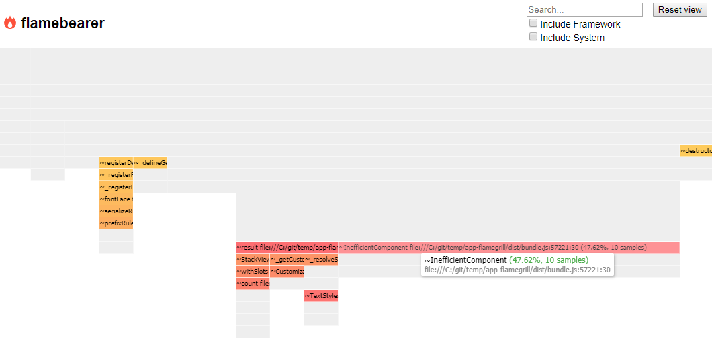

This example creates a basic app from scratch, adds an artificial bottleneck to it, and then shows you how to configure the build and run flamegrill to see the artificial bottleneck.

## Basic App Setup

1. Create App

Create a basic Fabric app using:

`npm init uifabric`


2. Create Sample Hotspot

In the app's `src/App.tsx` file, add an `InefficientComponent`:

```tsx
const InefficientComponent: React.FunctionComponent = (props) => {
  // This is an abritrary bottleneck to show in flamegraph results.
  for (let i = 0; i < 100; i++) {
    console.log(i);
  }
  return <div>{props.children}</div>
}
```

3. Add Hotspot to App

In the same `src/App.tsx` file, use `InefficientComponent`:

 ```tsx
 export const App: React.FunctionComponent = () => {
    return 
      // ... 
      <InefficientComponent>
        
      </InefficientComponent>
```

4. Modify Build Configuration

In the app's root directory, modify `webpack.config.js`:

```tsx
  {
    // Here you can add custom webpack configurations
    optimization: {
      // We no not want to minimize our code.
      minimize: false
    },
  }
```

5. Build App

`yarn build`

This should generate `dist/index.html` which we will use in flamegrill.


## Run Flamegrill

1. [Install Flamegrill](./installation)

2. Create an Output Directory

Flamegrill will create file output, so find or create a directory from which to run flamegrill.

3. Run Flamegrill

Modifying the path as appropriate, run flamegrill against `dist/index.html` generated with the build above:

```bash
flamegrill -n AppTest -s file:///C:/app/dist/index.html
```

## Inspect Results

In the directory where you run flamegrill, there should be an `AppTest.html` file which you can open in a browser. Opening it should reveal a flamegraph similar to the following, highlighting `InefficientComponent` as a bottleneck taking up nearly 60% of render time.



We can see here that `InefficientComponent` stands out quite a bit, consuming 47.62% of total render time.
